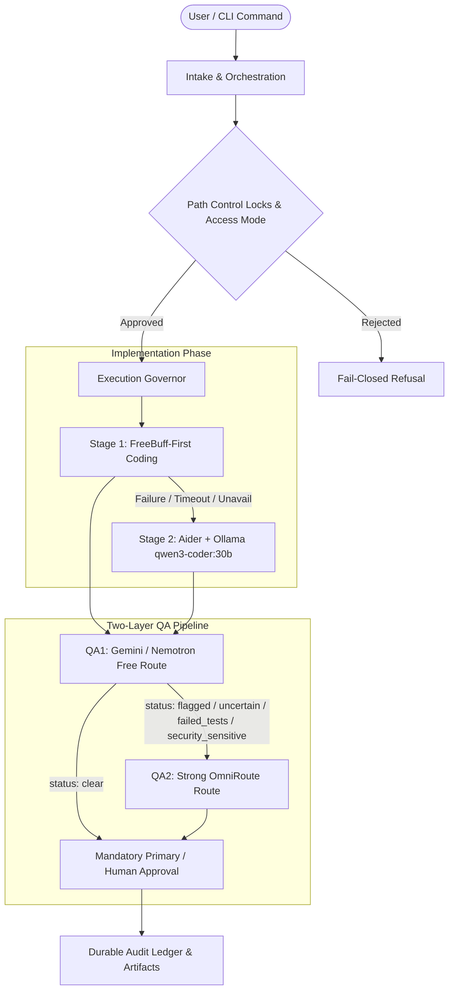

# Guardian Agent — Autonomous AI Co-Pilot & Zero-Trust Governance Framework

[](file:///media/lalit/HIKVISION1/AI%20agent%20model/tests)
[](https://python.org)
[](#zero-trust-security-model)

**Guardian Agent** is a local-first, privacy-respecting, zero-trust AI co-pilot governor designed for safe autonomous software development, multi-model routing, and subscription application orchestration.

It acts as a strict governance layer over AI coding agents, browser automation, and subscription connectors (Canva, Adobe, Lovable), preventing runaway token costs, unsafe file modifications, silent side effects, and unauthorized remote calls.

---

## 🎯 What Guardian Agent Achieves

1. **Zero-Trust Security & Path Control Locks**:
   - **Path Locks**: Stages with empty allowlists (`allowed_paths=[]`) strictly prohibit file writes. Writable coding tasks require explicit orchestration path approval.
   - **Secret Reservation Tokens**: Sensitive actions require secret `reservation_token`s and exact scope matching (`user_id`, `account_id`, `connector_scope`).
   - **Owner Tokens & Idempotency**: Connector operations generate secret `owner_token`s (`otok-...`). Interrupted operations fail closed to `"unknown_outcome"` requiring explicit reconciliation before retrying.

2. **Cost & Token Optimization**:
   - **FreeBuff-First Priority**: Coding tasks attempt **FreeBuff** *first*, eliminating remote API token costs.
   - **Local GPU Acceleration**: On-device Ollama execution powered by **`qwen3-coder:30b`** on AMD RX 7900 XTX at `priority=0`.
   - **Two-Layer QA Escalation**: QA1 (free Gemini/Nemotron route) evaluates compact diffs and tests. `clear` QA1 outcomes skip expensive QA2 routes entirely.
   - **Fresh Bounded Handoffs**: Every coding task starts a fresh, isolated session with bounded context, eliminating prompt token inflation and context pollution.

3. **Autonomous Daemon & Concurrency**:
   - Background worker daemon (`supervisor_daemon_run`) coordinates stale lease recoveries, ticket dispatches, and parallel worker execution (`max_workers=4`) with emergency kill-switch safeguards.

---

## 🏗️ End-to-End System Architecture



---

## ⚡ Phase 8 — FreeBuff-First & Two-Layer QA Pipeline

Guardian Agent enforces a strict project-level execution and QA policy:

### 1. Execution Priority Order
1. **Stage 1 (Primary Implementation)**: **FreeBuff** interactive coding session (fresh bounded handoff).
2. **Stage 2 (Fallback Implementation)**: Local Ollama **`qwen3-coder:30b`** + Aider fallback when FreeBuff is unavailable, fails, or times out.
3. **Stage 3 (Specialist Model)**: Healthy free/free-limited OmniRoute routes.

### 2. Two-Layer QA Pipeline & Escalation Schema
- **QA1 (First-Layer QA)**:
  - Formats compact diffs, test outputs, criteria, and risks for free Gemini/Nemotron routes.
  - Returns structured status in: `{"clear", "flagged", "uncertain", "failed_tests", "security_sensitive"}`.
- **QA2 Escalation (Second-Layer QA)**:
  - **`clear` QA1 Outcome**: QA2 is **skipped** (saving API tokens & latency).
  - **Non-`clear` QA1 Outcome**: Escalates to QA2 (strong OmniRoute route like Claude 3.5 Sonnet / GPT-4o).
- **Mandatory Final Approval**:
  - Requires QA2 result (if escalated) plus primary model / human user green-signal before stage completion. Cannot be bypassed.

---

## 💻 Local GPU Setup (`qwen3-coder:30b` on RX 7900 XTX)

To configure Guardian for local GPU execution with highest coding priority (`priority=0`):

```bash
# Register local Ollama with qwen3-coder:30b at priority 0
guardian provider setup-ollama --model qwen3-coder:30b

# Verify coding route selects qwen3-coder:30b
guardian provider route --task coding
```

Expected output:
```json
{
  "provider": "local-ollama",
  "model": "qwen3-coder:30b",
  "cost_tier": "local",
  "priority": 0
}
```

---

## 📖 Comprehensive CLI Reference

### 1. Provider & Gateway Management
```bash
# Register local Ollama provider endpoint
guardian provider setup-ollama --model qwen3-coder:30b

# Discover installed local Ollama models
guardian provider discover-ollama

# Route task to optimal model
guardian provider route --task "Refactor authentication layer"

# Test streaming route execution
guardian provider test --id local-ollama --model qwen3-coder:30b --prompt "Return OK"

# Inspect provider capacity and rate-limit headers
guardian provider capacity
```

### 2. Orchestration & Execution Planning
```bash
# Start task intake
guardian orchestrate start --task "Implement OAuth login" --approved-path "src/"

# Confirm orchestration requirement
guardian orchestrate confirm --id orch-xxxxxxxx --task "Implement OAuth login"

# Dispatch orchestration for execution
guardian orchestrate dispatch --id orch-xxxxxxxx

# Create multi-stage execution plan
guardian execution plan --id orch-xxxxxxxx

# Run foreground supervisor cycle
guardian supervisor run --interval-seconds 60 --max-cycles 1
```

### 3. Browser Operator & Visual Manual Takeover
```bash
# Test web page inspection
guardian browser test --url https://canva.com --account-id canva_main

# Perform preflight-validated browser action
guardian browser action --url https://canva.com --action click --selector "button#submit" --account-id canva_main --approval-id app-xxxxxxxx

# Control visual manual browser takeover
guardian browser takeover status --account-id canva_main
guardian browser takeover resume --account-id canva_main
guardian browser takeover cancel --account-id canva_main
```

### 4. Subscription Connectors & Reconciliation
```bash
# Authenticate account via vault
guardian connector auth --connector canva --account-id canva_main

# List creative assets
guardian connector list --connector canva --account-id canva_main

# Reconcile interrupted or stale connector operation
guardian connector reconcile \
  --connector canva \
  --action create_asset \
  --idempotency-key key-xxxxxxxx \
  --resolution cancelled \
  --reason "Verified design was not created on Canva"
```

---

## 🧪 Testing & Verification

Guardian Agent includes a comprehensive test suite covering security boundaries, idempotency, browser preflights, supervisor daemon concurrency, and Phase 8 QA routing.

```bash
# Run full unit test suite (555 tests)
PYTHONPATH=src python3 -m unittest discover -s tests -q

# Run Phase 8 FreeBuff and QA test suite
PYTHONPATH=src python3 -m unittest discover -s tests -p 'test_phase8_freebuff_qa.py' -v

# Run code hygiene checks
git diff --check && python3 -m compileall -q src tests
```

---

## 🔒 Zero-Trust Security Model

- **Fail-Closed Default**: Any unhandled exception, missing permission, or invalid token causes immediate execution refusal.
- **Secret Redaction**: Environment variables, API keys, and vault references (`vault:...`) are automatically redacted from error traces and journey logs.
- **Non-Destructive Takeover**: Visual manual browser takeover injects a floating DOM banner overlay without wiping active page state.
- **Audit Ledger**: All operations, policy decisions, and receipts are recorded in durable JSON audit ledgers under `.agent/audit/`.

---

## 📜 License

Licensed under the MIT License. See [LICENSE](LICENSE) for details.
